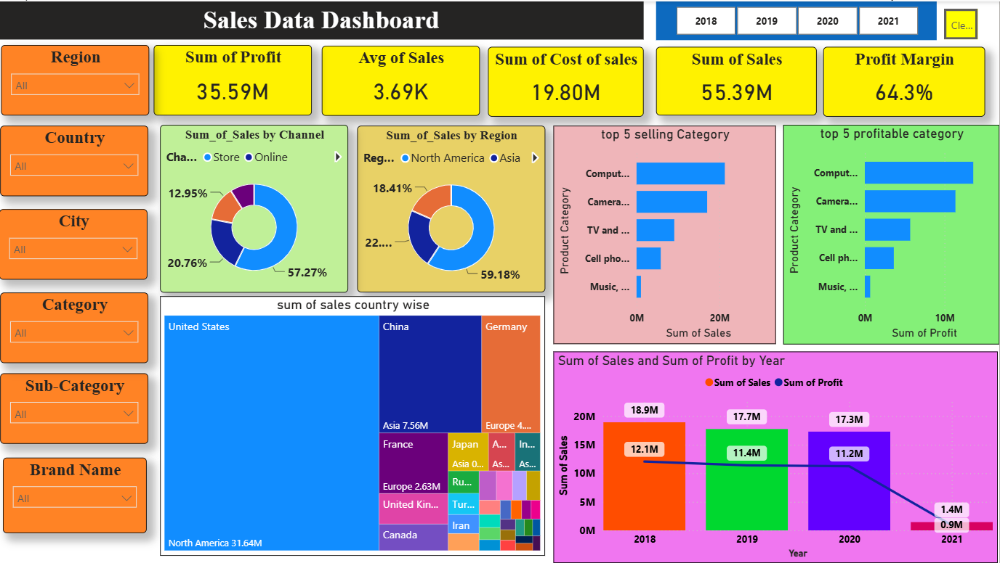

# Sales Data Analysis Dashboard (Power BI)

An interactive, high-impact **Power BI Sales Analytics Dashboard** designed to visualize multi-year sales performance, profit margins, regional distribution, and product category trends.



---

## 📊 Executive Summary & Key Metrics

| Key Metric | Value | Description |
| :--- | :--- | :--- |
| **Sum of Sales** | **$55.39M** | Total revenue generated across all regions and channels |
| **Sum of Profit** | **$35.59M** | Overall net profit generated |
| **Sum of Cost of Sales** | **$19.80M** | Total cost of goods sold |
| **Profit Margin** | **64.3%** | Overall business profitability percentage |
| **Average Sales** | **$3.69K** | Average transaction sales value |

---

## 🎯 Dashboard Features & Visualizations

### 1. KPI Scorecards
- **Instant Insights**: High-level KPI cards displaying Total Revenue, Cost, Net Profit, Profit Margin, and Average Transaction Value.

### 2. Channel & Regional Distribution
- **Sales by Channel (Donut Chart)**: Breaks down total sales by sales channels (**Online vs. Store**), highlighting a strong online presence (**57.27%**).
- **Sales by Region (Donut Chart)**: Details regional market distribution led by **North America (59.18%)**, followed by **Asia (22%)** and Europe.

### 3. Country-Wise Performance (Treemap)
- **Global Sales Heatmap**: Visualizes sales volume across major countries including the **United States**, **China**, **Germany**, **France**, **Japan**, **United Kingdom**, **Canada**, and others.

### 4. Product Category Insights
- **Top 5 Selling Categories**: Identifies top revenue-driving product categories (Computers, Cameras, TV & Video, Cell Phones, Music/Movie/Audio).
- **Top 5 Profitable Categories**: Pinpoints highest margin product lines to optimize inventory and marketing efforts.

### 5. Multi-Year Trend Analysis (2018 - 2021)
- **Sales & Profit Combo Chart**: Tracks yearly performance trends comparing revenue against profit margins across 2018 ($18.9M sales), 2019 ($17.7M sales), 2020 ($17.3M sales), and 2021.

### 6. Interactive Multi-Level Slicers
- Dynamic filters for granular data exploration:
  - **Region**, **Country**, **City**
  - **Category**, **Sub-Category**, **Brand Name**
  - **Year Selector (2018, 2019, 2020, 2021)** with instant clear filter options.

---

## 📁 Repository Structure

```text
sales_data_powerbi/
├── image.png                 # Dashboard screenshot preview
├── README.md                 # Project documentation
├── sales_data_dashboard.pbix # Power BI Dashboard source file
└── SalesData.xlsx            # Source Excel dataset
```

---

## 🚀 How to View & Use the Dashboard

1. **Install Power BI Desktop**: Download and install [Microsoft Power BI Desktop](https://powerbi.microsoft.com/desktop/) if not already installed.
2. **Clone / Download Repository**: Download or clone this repository to your local system.
3. **Open Report**: Double-click [`sales_data_dashboard.pbix`](file:///c:/Users/ugale/Naresh%20IT/sales_data_powerbi/sales_data_dashboard.pbix) to launch the report in Power BI Desktop.
4. **Interact**: Use the left slicers and top year buttons to filter and explore insights interactively.